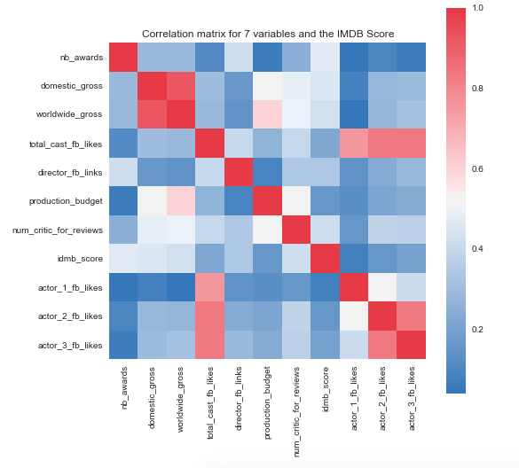
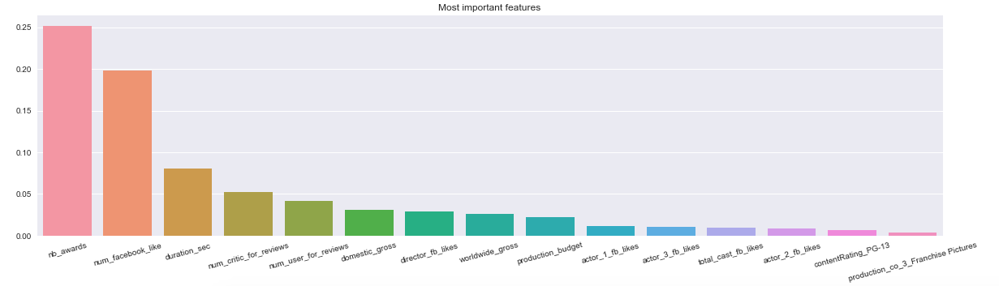

# Predicting IMDB Movie Ratings

In this project, I tried to answer one simple question: **Can we predict how good a movie will be before it even releases?**

## Part 1 - Collecting Data

In this part, I collected data from the IMDB and The Numbers websites. The data includes things like cast details, directors, production companies, awards, genres, budget, box office earnings, movie descriptions, and IMDB ratings.

To generate the `movie_contents.json` file, run:
``python3 parser.py nb_elements``

## Part 2 - Exploring the Data

Here, I looked at the data to find connections between different variables. For example:
- Do awards have anything to do with how much a movie earns worldwide?
- Does a popular cast lead to a higher IMDB rating?

Check out the Jupyter notebook for the full analysis.

From the correlation matrix above, I found some interesting things:
- The IMDB score is related to the number of awards a movie wins and how much it earns — but not much to the production budget or cast's Facebook popularity.
- As expected, domestic and worldwide earnings are closely related. Also, bigger budgets generally lead to bigger earnings.
- Surprisingly, budget doesn't have much connection to winning awards.
- One interesting finding: the popularity of the **third most famous actor** in a movie matters more for the IMDB score than the most famous one (correlation of 0.2 vs 0.08).

There are many more charts and observations inside the Jupyter notebook!

## Part 3 - Predicting the IMDB Score

Finally, I used Machine Learning to predict the IMDB score based on the most useful variables. I used a **Random Forest model with 500 decision trees**.

